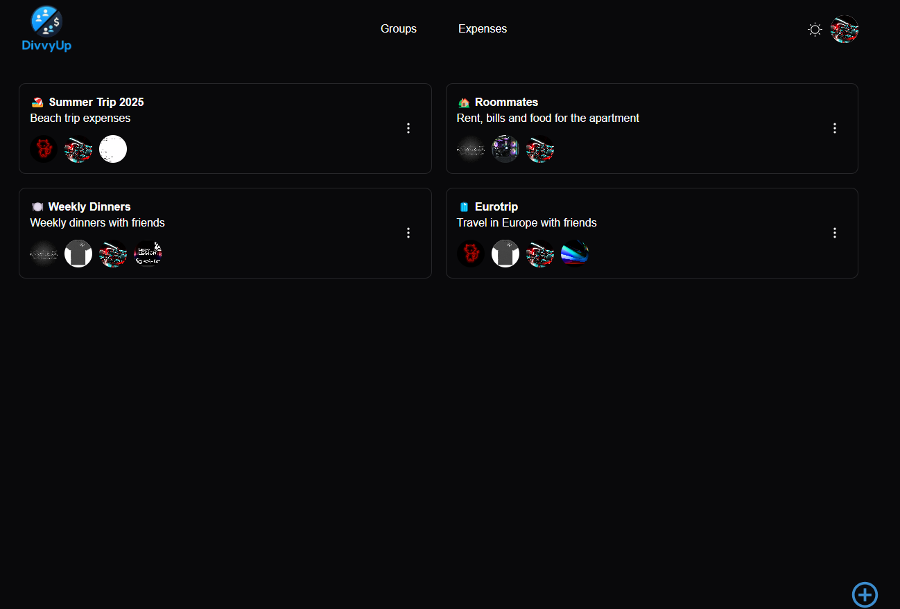
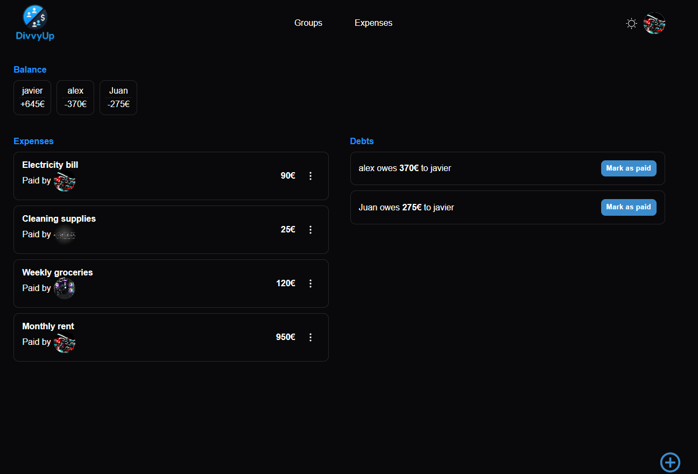
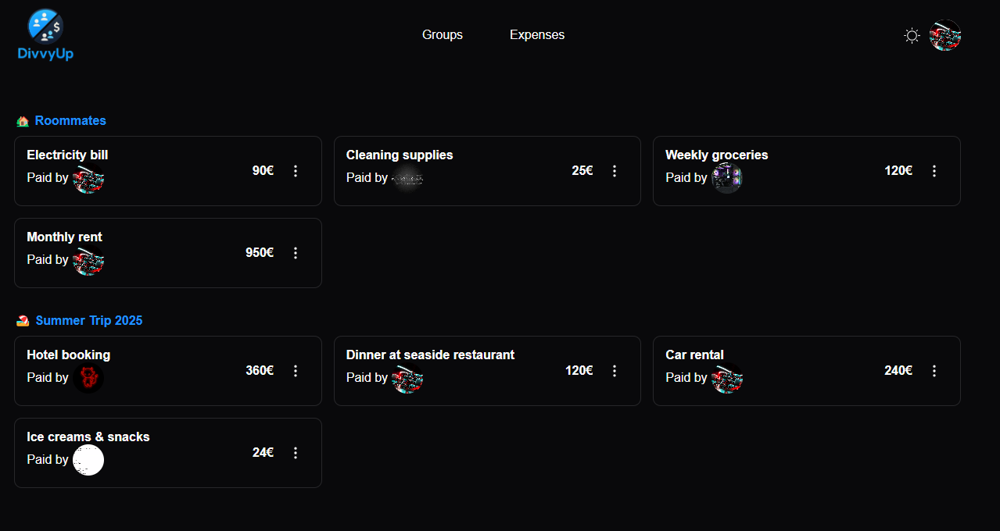
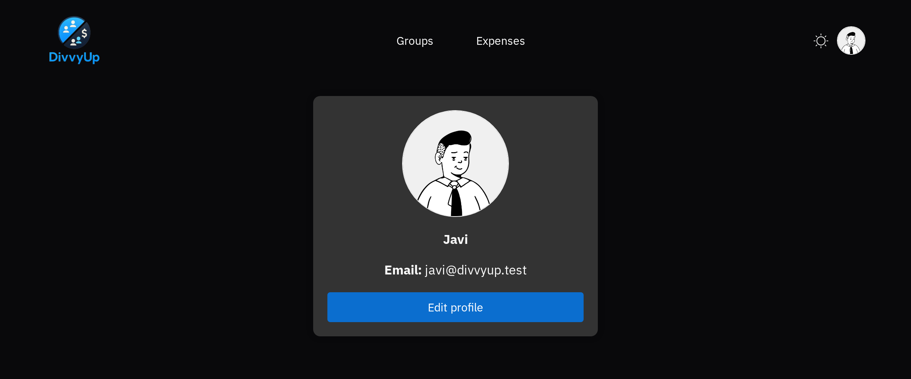

<p align="center">
  
</p>

# DivvyUp 💸
DivvyUp is a **web application for splitting group expenses**, designed to help users manage shared costs with friends, roommates, or travel companions.

With DivvyUp, you can create groups, add expenses with multiple participants, and automatically calculate how much each member owes. The app also allows you to settle debts by marking payments as completed, ensuring the group's balance stays up to date.

---


## 🛠️ Tech Stack

The project is a **pnpm-workspaces monorepo** driven by **Turborepo**. All workspaces are ESM and **TypeScript** (`strict`); the serialized API contract lives in `packages/shared` (`@monorepo/shared`), typed on both ends.

### Frontend
- **React 18** + **Vite** + **TypeScript** (`strict`)
- **React Router DOM 7**
- **TanStack Query (React Query) v5**
- **React Hook Form**
- **MUI (Material UI)**
- **CSS Modules**
- **Axios**
- **Better Auth** (React client — cookie session)
- **React Toastify**
- **React Tooltip**
- **Socket.io Client**

### Backend
- **Node.js** + **Express**
- **TypeScript** (`strict`)
- **MongoDB** with **Mongoose** (`InferSchemaType`)
- **decimal.js** — all monetary math (never native floats)
- **Better Auth** — email/password auth with `httpOnly` cookie sessions
- **Socket.io** — real-time notifications
- **Cloudinary** (profile images) + **Multer**
- **Resend** — transactional email

### Tooling
- **pnpm** (package manager, pinned via `packageManager`)
- **Turborepo** (task pipeline)
- **tsx** (dev) / **tsc** (build to `dist/`)
- **Vitest** + **Supertest** (backend), **Vitest** + **Cypress** + **Storybook** (frontend)
- **Docker** (backend image) + **MongoDB Atlas**

### Deployment
- 🌐 **Frontend** → [Cloudflare Pages](https://pages.cloudflare.com/), live at **https://divvyup.jorgeaf.dev**
- 🌐 **Backend** → self-hosted **[Coolify](https://coolify.io/)** on an OVH VPS, live at **https://divvyup-api.jorgeaf.dev**
- 🛢️ **Database** → [MongoDB Atlas](https://www.mongodb.com/cloud/atlas)
- 📦 **Image registry** → GitHub Container Registry (`ghcr.io`)

**How it ships.** A push to `main` that touches the backend triggers a GitHub Action: it builds the multi-stage `backend/Dockerfile`, pushes `ghcr.io/divvyup-app/splitwise:latest`, then triggers a Coolify redeploy and polls it to `finished`/`failed`, so a broken image fails the job instead of going green. The frontend is built by Cloudflare Pages straight from the repo (`vite build`).

---


## 📦 Installation & Setup

Follow the steps below to run the project locally.

### 1. Clone the Repository and install dependencies

```bash
git clone https://github.com/DivvyUp-app/DivvyUp.git
cd DivvyUp
pnpm install
```

### 2. Environment Variables

You need to create two `.env` files:

- One inside the `frontend` folder
- One inside the `backend` folder

#### 📁 Frontend `.env` (located in `frontend/`)

```env
VITE_API_URL=http://localhost:3001/api
VITE_SOCKET_URL=http://localhost:3001
```

#### 📁 Backend `.env` (located in `backend/`)

```env
MONGO_URL=<your_mongo_db_url>
# Better Auth: a random secret (e.g. `node -e "console.log(require('crypto').randomBytes(32).toString('hex'))"`)
# and the backend's own origin (no /api/auth suffix — Better Auth appends it).
BETTER_AUTH_SECRET=<your_better_auth_secret>
BETTER_AUTH_URL=http://localhost:3001
RESEND_API_KEY=<your_resend_api_key>
# Optional; defaults to "DivvyUp <onboarding@resend.dev>" (Resend's test sender)
RESEND_FROM=<your_verified_sender>

CLOUDINARY_CLOUD_NAME=<your_cloudinary_cloud_name>
CLOUDINARY_API_KEY=<your_cloudinary_api_key>
CLOUDINARY_API_SECRET=<your_cloudinary_api_secret>

CLIENT_URL=http://localhost:3000
```


### 🚀 Running the Project

This project is a **monorepo** that contains both the **frontend** and **backend** in the same repository. You can start both simultaneously with a single command.

From the root directory (Turborepo starts both: frontend on `:3000`, backend on `:3001`):

```bash
pnpm dev
```


## 📁 Project Structure

```
DivvyUp/
│
├── backend/                # Backend built with Node.js, Express and MongoDB (TypeScript)
│   ├── src/
│   │   ├── config/         # Cloudinary and Multer setup
│   │   ├── controllers/    # Route controller logic
│   │   ├── mongo/          # MongoDB connection
│   │   ├── routers/        # Express route definitions
│   │   ├── schemas/        # Mongoose models
│   │   ├── security/       # JWT middleware
│   │   ├── serializers/    # Mongoose docs -> @monorepo/shared response contract
│   │   ├── services/       # Core domain logic (ledger, split, email, notifications)
│   │   ├── socket/         # WebSocket server and event handlers
│   │   ├── types/          # Ambient type declarations
│   │   ├── utils/          # Member hydration and shared validation helpers
│   │   ├── tests/          # Vitest suites
│   │   └── index.ts
│   ├── Dockerfile          # Multi-stage: tsc -> dist/, runtime ships dist only
│   ├── tsconfig*.json
│   └── package.json
│
├── frontend/               # Frontend built with React, Vite and TypeScript
│   ├── public/             # Static assets (e.g., favicon, logo)
│   ├── src/
│   │   ├── assets/         # Images and icons
│   │   ├── components/     # Reusable UI components
│   │   ├── context/        # React context (auth, theme, etc.)
│   │   ├── hooks/          # Custom hooks
│   │   ├── pages/          # Application pages (routes)
│   │   ├── stories/        # Storybook stories
│   │   ├── utils/          # Utility functions
│   │   ├── App.tsx         # Root component
│   │   └── main.tsx        # ReactDOM entry point
│   ├── .env                # Environment variables (frontend)
│   └── index.html
│   └── package.json   
│
├── packages/
│   └── shared/             # @monorepo/shared — serialized API contract (compiled to dist/)
│
├── package.json            # Root package file (monorepo manager)
├── turbo.json              # Turborepo config
└── docker-compose.yaml     # (Optional) Docker setup
```

---

## ✅ Main Features

- Create and manage groups.
- Add expenses within a group.
- Calculate individual user balances.
- Automatically generate debts based on group expenses.
- Mark debts as paid.
- Real-time notifications via WebSockets.
- User authentication and session management.
- Dark mode support.
- Profile image upload with Cloudinary.


## 🌐 Live Demo

You can try the project live here: **[https://divvyup.jorgeaf.dev](https://divvyup.jorgeaf.dev)**

---

## 📸 Screenshots

### 🧑‍🤝‍🧑 Groups


Overview of the groups in which the user is a member

### 📋 Group details


Displays the details of a specific group, including recorded expenses, user balances, and pending debts.

### 💸 User expenses


Section where the user can view all the expenses they’ve participated in, organized by group.

### 🙋‍♂️ Profile


User profile screen with options to edit personal information or log out.

---

## Authors

- [Jorge Álvarez](https://github.com/JorgeAFdev)
- [Alex Biescas](https://github.com/biescaszzz)

---

## 📄 License

This project is licensed under the [MIT License](LICENSE).